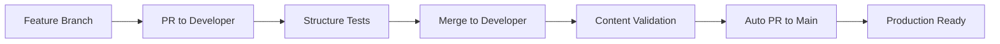

# 🏗️ Prueba Técnica Frontend - React + TypeScript

## 📋 Descripción del Proyecto

Este proyecto es una **prueba técnica frontend** que implementa una aplicación completa de gestión con React + TypeScript, incluyendo autenticación, dashboard y módulo de productos. El objetivo es evaluar las habilidades para:

- 🐛 **Identificar y solucionar errores** de TypeScript
- 🏗️ **Trabajar con arquitectura modular** bien estructurada
- ⚛️ **Debugging de aplicaciones React** complejas
- 🔧 **Manejo de tipos e interfaces** TypeScript
- 🎯 **Resolución de problemas** en código existente

## 🎯 Objetivos de la Prueba

### 1. **Estructura de Carpetas (25 puntos)**
- Mantener la arquitectura `core` con módulos dinámicos
- Validar que la estructura siga las convenciones establecidas
- Cada módulo debe tener las 8 carpetas requeridas

### 2. **Resolución de Errores (50 puntos)** 
- Identificar y corregir **2 errores principales** (8 errores de TypeScript en total)
- Hacer que la aplicación funcione sin warnings ni errores

### 3. **Testing Dinámico (25 puntos)**
- Entender el sistema de testing de estructura
- Ejecutar y validar que todos los tests pasen
- Opcional: Agregar tests adicionales

### 4. **Funcionalidad (25 puntos)**
- Completar el módulo de productos
- Navegar y usar todas las funcionalidades
- Opcional: Agregar nuevas características

---

## 🚀 Setup Inicial

### Prerrequisitos
- Node.js 18+ 
- npm o yarn
- Git

### Instalación
```bash
# Clonar el repositorio
git clone [repository-url]
cd tecnicafrontend

# Instalar dependencias
npm install

# Intentar ejecutar la aplicación (fallará con errores)
npm start
```

---

## 🐛 Errores Intencionales a Resolver

Este proyecto contiene **múltiples tipos de errores** que debes identificar y corregir:

---

## 🔴 **ERRORES DE TYPESCRIPT (10 errores totales)**

### ❌ **Error Principal 1: LoginForm.tsx (6 errores)**
**Archivo**: `src/core/auth/components/forms/LoginForm.tsx`  
**Problema**: Uso incorrecto de `FormData` nativo en lugar de tipo personalizado  
**Síntomas**: Múltiples errores sobre propiedades inexistentes

```typescript
// ❌ Incorrecto (línea ~8)
const [formData, setFormData] = useState<FormData>({
  email: '',
  password: ''
});

// ✅ Correcto - usar el tipo adecuado
interface LoginFormData {
  email: string;
  password: string;
}
const [formData, setFormData] = useState<LoginFormData>({
  email: '',
  password: ''
});
```

**Errores específicos**:
- `Property 'email' does not exist on type 'FormData'` (línea 29, 34, 69)
- `Property 'password' does not exist on type 'FormData'` (línea 29, 34, 85)
- `Argument of type... is not assignable` (línea 8)

### ❌ **Error Principal 2: productApi.ts (1 error)**
**Archivo**: `src/core/products/services/productApi.ts`  
**Problema**: Método `searchProducts` declarado pero no implementado  
**Usado en**: `src/core/products/hooks/useProducts.ts` línea 106

```typescript
// ❌ Problema: useProducts.ts intenta usar método inexistente
const results = await productApi.searchProducts(searchTerm);

// ✅ Solución: Implementar en productApi.ts
searchProducts: async (query: string): Promise<Product[]> => {
  // Simular búsqueda filtrada
  const allProducts = await this.getProducts();
  return allProducts.filter(product => 
    product.name.toLowerCase().includes(query.toLowerCase()) ||
    product.description.toLowerCase().includes(query.toLowerCase())
  );
}
```

### ❌ **Errores Secundarios: Imports rotos (3 errores)**
Estos errores aparecen por carpetas faltantes (ver sección de estructura):
- `Dashboard.tsx`: No encuentra `../common/NavigationHeader`
- `ProductsView.tsx`: No encuentra NavigationHeader

---

## 📁 **ERRORES DE ESTRUCTURA (5 tests fallando)**

### 🗂️ **Carpetas eliminadas intencionalmente:**

```bash
# CARPETAS FALTANTES QUE DEBES CREAR:

src/core/auth/
├── validations/     # ❌ FALTA - Para validaciones de formularios
└── hooks/           # ❌ FALTA - Para custom hooks de autenticación

src/core/products/ 
└── utils/           # ❌ FALTA - Para utilidades del módulo

src/core/shared/
└── common/          # ❌ FALTA - Para componentes comunes compartidos

src/core/dashboard/components/
└── common/          # ❌ FALTA - Carpeta eliminada (rompe imports)
```

### 📊 **Estado actual de módulos:**
- ✅ **dashboard**: 8/8 carpetas (100%) - **ÚNICO VÁLIDO**
- ❌ **auth**: 6/8 carpetas (75%) - faltan: `validations`, `hooks`
- ❌ **products**: 7/8 carpetas (87.5%) - falta: `utils` 
- ❌ **shared**: 3/4 carpetas (75%) - falta: `common`

### 🎯 **Requisitos estrictos:**
Cada módulo DEBE tener las **8 carpetas obligatorias**:
- `components/` (con al menos 1 subcarpeta)
- `validations/` 
- `hooks/`
- `services/`
- `types/`
- `utils/`
- `contexts/`
- `constants/`

---

## ✅ **Cómo verificar tu progreso:**

```bash
# Verificación rápida (TypeScript + estructura)
npm run validate

# Verificación completa (incluye build)
npm run validate:full

# Status detallado con colores y estadísticas  
npm run check-status
```

### 📋 **Orden recomendado de corrección:**
1. **Crear carpetas faltantes** (arregla imports rotos)
2. **Corregir errores TypeScript** principales
3. **Verificar que tests de estructura pasen**
4. **Verificar que build funcione**

---

## 🧪 Testing de Estructura

### Ejecutar Tests
```bash
# Ejecutar tests de estructura
npm run test:structure

# Ejecutar en modo watch
npm run test:structure:watch

# Ejecutar con interfaz visual
npm run test:structure:ui
```

### Sistema de Testing Dinámico

El proyecto incluye un **sistema de testing dinámico** que:

- 🔍 **Detecta automáticamente** módulos en `src/core/`
- ✅ **Valida estructura** sin nombres hardcodeados
- 📊 **Genera reportes** detallados de cobertura
- 🏗️ **Verifica arquitectura** de cada módulo

### Estructura Validada
```
src/core/
├── shared/           # ✅ Componentes compartidos
│   ├── common/       # ✅ Elementos UI básicos
│   ├── forms/        # ✅ Formularios reutilizables
│   ├── views/        # ✅ Layouts compartidos
│   └── cards/        # ✅ Tarjetas genéricas
│
├── [módulo]/         # ✅ Cualquier nombre de módulo
│   ├── components/   # ✅ Componentes del módulo
│   ├── validations/  # ✅ Esquemas de validación
│   ├── hooks/        # ✅ Custom hooks
│   ├── services/     # ✅ APIs y lógica de negocio
│   ├── types/        # ✅ Tipos TypeScript
│   ├── utils/        # ✅ Funciones utilitarias
│   ├── contexts/     # ✅ Contextos React
│   └── constants/    # ✅ Constantes del módulo
```

---

## 🚀 Flujo CI/CD

### GitHub Actions Workflows

#### 1. **Structure Validation** (feature → developer)
**Archivo**: `.github/workflows/structure-validation.yml`

```yaml
# Se ejecuta cuando:
- PR hacia developer/develop  
- Push a developer/develop
- Cambios en src/core/** o tests/**
```

**Validaciones**:
- ✅ Testing de estructura de carpetas
- ✅ Verificación de módulos dinámicos  
- ✅ Validación de subcarpetas requeridas
- ✅ Comentarios automáticos en PR

#### 2. **Promote to Main** (developer → main)  
**Archivo**: `.github/workflows/promote-to-main.yml`

```yaml
# Se ejecuta cuando:
- PR de developer hacia main
- Push exitoso a developer (auto-PR)
```

**Validaciones**:
- ✅ Testing completo de estructura
- ✅ Validación de contenido en módulos
- ✅ Build de producción
- ✅ Verificación que módulos no estén vacíos

### Flujo de Trabajo



---

## ⚛️ Módulo de Productos

### Funcionalidades Implementadas

#### 🏠 Vista Principal (`ProductsView`)
- **Dashboard de estadísticas** (total, en stock, sin stock)
- **Búsqueda avanzada** por nombre, descripción, tags
- **Filtros por categoría**
- **Lista responsive** de productos
- **CRUD básico** (ver, editar, eliminar)

#### 🃏 Tarjeta de Producto (`ProductCard`)  
- **Imagen** del producto con fallback
- **Información detallada** (precio, stock, categoría)
- **Tags dinámicos** con límite visual
- **Estados visuales** (sin stock, nuevo, etc.)
- **Acciones rápidas** (ver, editar, eliminar)

#### 🎣 Hook Personalizado (`useProducts`)
- **Estado centralizado** de productos
- **Operaciones CRUD** completas
- **Filtros dinámicos** aplicables
- **Gestión de errores** integrada
- **Loading states** automáticos

#### 🌐 API Service (`productApi`)
- **Datos mock realistas** para demostración
- **5 productos de ejemplo** con imágenes
- **4 categorías** (Tecnología, Ropa, Hogar, Deportes)
- **Simulación de latencia** de red
- **Operaciones async** completas

### Navegación
1. **Login** → Dashboard (admin@test.com / password)
2. **Dashboard** → Click en card "Productos" 
3. **Productos** → Vista completa de gestión

---

## 📁 Estructura del Proyecto

```
tecnicafrontend/
├── src/
│   ├── core/                        # 🏗️ Arquitectura principal
│   │   ├── shared/                  # 🔄 Recursos compartidos
│   │   │   ├── common/
│   │   │   ├── forms/
│   │   │   ├── views/
│   │   │   └── cards/
│   │   │
│   │   ├── auth/                    # 🔐 Módulo autenticación
│   │   │   ├── components/
│   │   │   │   ├── forms/           # ❌ LoginForm (Error 3,4)
│   │   │   │   ├── common/
│   │   │   │   ├── views/
│   │   │   │   └── cards/
│   │   │   ├── contexts/            # AuthContext
│   │   │   ├── hooks/
│   │   │   ├── services/
│   │   │   ├── types/
│   │   │   ├── utils/
│   │   │   ├── validations/
│   │   │   └── constants/
│   │   │
│   │   ├── dashboard/               # 📊 Módulo dashboard  
│   │   │   ├── components/
│   │   │   │   └── views/           # ❌ Dashboard (Error 1,2)
│   │   │   └── [otras carpetas...]
│   │   │
│   │   └── products/                # 📦 Módulo productos
│   │       ├── components/
│   │       │   ├── cards/           # ProductCard
│   │       │   └── views/           # ProductsView  
│   │       ├── hooks/               # useProducts
│   │       ├── services/            # productApi
│   │       ├── types/               # Product interfaces
│   │       └── [otras carpetas...]
│   │
│   ├── App.js                       # 🚀 Router principal
│   └── index.js                     # 📍 Entry point
│
├── tests/
│   └── structure/                   # 🧪 Tests dinámicos
│       ├── structure.test.js        # Test principal
│       ├── structureValidator.js    # Validador dinámico
│       └── expectedStructure.js     # Configuración
│
├── .github/workflows/               # 🚀 GitHub Actions
│   ├── structure-validation.yml    # CI para developer
│   └── promote-to-main.yml         # CD para main
│
└── package.json                     # 📦 Dependencias y scripts
```

---

## 🎯 Instrucciones de Resolución

### Paso 1: Identificar Errores (25 pts)
1. **Ejecutar** `npm start` → Observar errores en consola
2. **Revisar** archivos mencionados en la sección "Errores"
3. **Corregir** uno por uno hasta que la app funcione
4. **Verificar** que no haya warnings en la consola

### Paso 2: Validar Testing (25 pts)  
1. **Ejecutar** `npm run test:structure`
2. **Verificar** que todos los tests pasen (11/11)
3. **Entender** el reporte de estructura generado
4. **Opcional**: Agregar un nuevo módulo y ver que se detecte

### Paso 3: Probar Funcionalidad (25 pts)
1. **Login** con credenciales: `admin@test.com` / `password`  
2. **Navegar** desde Dashboard → Productos
3. **Probar** búsqueda, filtros, eliminación
4. **Verificar** que las estadísticas se actualicen

### Paso 4: Entender CI/CD (25 pts)
1. **Revisar** archivos en `.github/workflows/`
2. **Entender** el flujo feature → developer → main
3. **Opcional**: Crear una feature branch y PR
4. **Opcional**: Modificar validaciones de testing

---

## 📚 Scripts Disponibles

```bash
# 🚀 Desarrollo
npm start                    # Ejecutar en modo desarrollo  
npm run build               # Build de producción

# 🧪 Testing  
npm run test:structure      # Tests de estructura
npm run test:structure:watch # Tests en modo watch
npm run test:structure:ui   # Interfaz visual de tests
npm run test:ci            # Tests para CI (JSON output)

# 🔍 Otros
npm run test               # Tests unitarios (React)
```

---

## 🏆 Criterios de Evaluación

### Excelente (90-100 pts)
- ✅ Todos los errores corregidos sin ayuda
- ✅ Tests pasando al 100%
- ✅ Funcionalidad completa probada
- ✅ Comprensión clara del CI/CD
- ✅ Mejoras o funcionalidades adicionales

### Bueno (70-89 pts)  
- ✅ 3-4 errores corregidos
- ✅ Tests mayormente pasando
- ✅ Funcionalidad básica funcionando
- ✅ Entendimiento general del proyecto

### Aceptable (50-69 pts)
- ✅ 2-3 errores corregidos  
- ✅ Algunos tests pasando
- ✅ App ejecutándose básicamente
- ⚠️ Necesita ayuda para CI/CD

### Insuficiente (<50 pts)
- ❌ Errores sin corregir
- ❌ Tests fallando
- ❌ App no funciona correctamente

---

## 🤝 Preguntas de la Entrevista

Prepárate para explicar:

1. **🏗️ Arquitectura**: ¿Por qué esta estructura de carpetas es escalable?

2. **🧪 Testing**: ¿Cómo funciona el sistema dinámico de detección de módulos?

3. **🐛 Debugging**: ¿Qué proceso seguiste para encontrar los errores?

4. **⚛️ React**: ¿Cómo organizaste el estado y la lógica en el módulo de productos?

5. **🚀 DevOps**: ¿Cuál es la ventaja del flujo CI/CD implementado?

6. **🔄 Escalabilidad**: ¿Cómo agregarías un nuevo módulo (ej: "orders")?

---

## 🔧 Tecnologías Utilizadas

- **⚛️ React 19** - Frontend framework
- **🎨 TailwindCSS** - Styling y diseño
- **🧪 Vitest** - Testing framework
- **🚀 GitHub Actions** - CI/CD
- **📡 React Router** - Navegación SPA
- **🎣 Custom Hooks** - Lógica reutilizable
- **📦 Context API** - Estado global
- **🔷 TypeScript interfaces** - Tipado fuerte

---

## 💡 Tips para el Éxito

- 🔍 **Lee los errores** en consola cuidadosamente
- 🧪 **Ejecuta tests** frecuentemente durante el desarrollo  
- 🎯 **Usa las herramientas** de desarrollo de React
- 📖 **Revisa la estructura** antes de hacer cambios
- 🚀 **Prueba la navegación** completa de la app
- 💬 **Haz preguntas** si algo no está claro

---

## 🎉 ¡Buena Suerte!

Esta prueba técnica está diseñada para evaluar tus habilidades reales de desarrollo frontend. **Tómate tu tiempo**, **lee cuidadosamente** y **demuestra tu capacidad** para trabajar con código existente, resolver problemas y entender arquitecturas complejas.

**¡Esperamos ver tu solución!** 🚀

---

*Creado con ❤️ para evaluar desarrolladores frontend talentosos*
